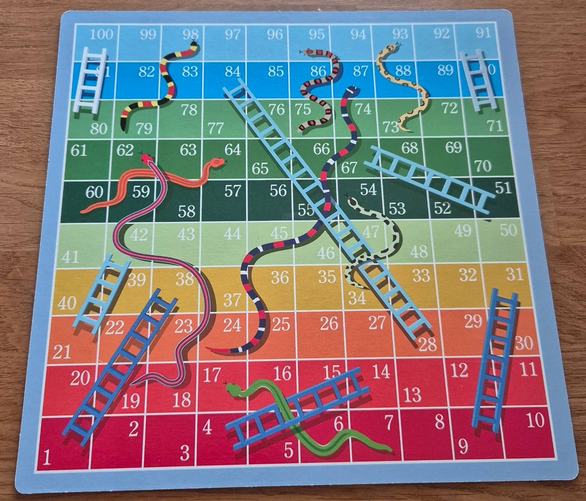

# Käärmeet ja tikapuut

A local, browser-based Snakes and Ladders game in Finnish, built to match the family's physical board so the kids can play the same game on a screen when the real one isn't handy.

## Play

Live at **https://mrojala.github.io/snakes-and-ladders/** — deployed from `main` via GitHub Pages.

## Reference — the physical board

The digital board mirrors the colours, numbering, and snake/ladder layout of this physical copy:



## Run

```bash
npm install
npm run dev
```

Open the URL shown in the terminal (usually `http://localhost:5173`).

## Build

```bash
npm run build      # typechecks + produces dist/
npm run preview    # serves the built dist/ locally
```

## Tech

Vite + TypeScript + plain DOM/CSS/SVG. No framework.

- `src/board/` — coordinates, config, view (grid + SVG snake/ladder overlay).
- `src/board/config.ts` is the single source of truth for snake/ladder positions and row colours. Correcting a misread position is a one-file edit.
- `src/game/` — game state and rules (upcoming).
- `src/ui/` — setup screen, dice, tokens, HUD (upcoming).

## Finnish copy

Player-facing text is Finnish only. Canonical game title is **Käärmeet ja tikapuut** per Finnish Wikipedia.
